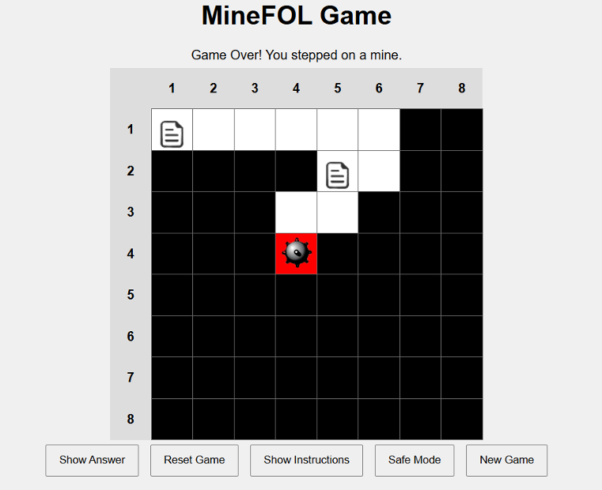

# MineFOL - A Logic-Based Grid Game  

## Overview  
**MineFOL** is a logic-driven puzzle game where players must use **First-Order Logic (FOL) clues** to uncover the locations of hidden mines on an **8x8 grid**. The game challenges players' deductive reasoning by providing logical statements that hint at **mine locations** and **safe cells**.  

This project implements the **logic mechanisms** of MineFOL using the **Prover9 tool**, an automated theorem prover that helps deduce safe moves based on revealed information. The project was implemented in **Pycharm** using **python** for back-end and **HTML, CSS and Javascript** for  front-end.

## Objective  
The goal is to correctly **identify the four mines** hidden in the grid **without stepping on a mine or incorrectly marking a safe cell**.  

## Gameplay  
- The game starts with all **cells covered** and the player positioned at the **top-left corner**.  
- The player can move **up, down, left, or right** to adjacent cells.  
- Each cell may contain:  
  - **A message** written in **First-Order Logic (FOL)**, providing clues about mines or safe zones.  
  - **A hidden mine** (stepping on it ends the game).  
  - **An empty space** (providing no information).  

## MineFOL Rules  
- **Grid Navigation:** Players can move freely in the four cardinal directions.  
- **Messages & Clues:** Logical statements provide hints about **mine locations** and **adjacent safe cells**.  
- **Checking for Mines:** Players can **double-click** on a cell to reveal whether it contains a **mine** or is **safe**.  
- **Losing the Game:** The player **loses** if they:  
  - Step on a mine.  
  - Incorrectly mark a safe cell as a mine.  
- **Winning the Game:** The player **wins** by successfully identifying all **four mines** without making an incorrect move.  
- **Prover9 Assistance (Safe Mode):** Players can activate **Safe Mode**, utilizing **Prover9** to deduce and highlight **safe cells** based on available logical clues.  

## Project Screenshot  
Below is an image of the MineFOL game in action:  

  
